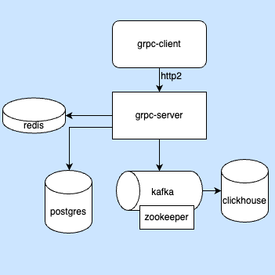

# gRPC Service AuthUsersApp

## The following concepts are applied in app:
- Development of a gRPC service based on a proto file in Go:
  - create
  - delete
  - list users
  - authorize user

- The Clean Architecture
- Authentication using a stateless approach (JWT)
- Postgres database using <a href="https://github.com/jmoiron/sqlx">sqlx</a> library.
- Kafka broker using <a href="https://github.com/Shopify/sarama">sarama</a> library.
- Clickhouse storage using <a href="https://github.com/ClickHouse/clickhouse-go">clickhouse-go</a> library.
- list users, the data is cached in <a href="https://redis.io/">redis</a> for 1 min.
- Graceful Shutdown.
- Running app in Docker containers.
- Client (grpcurl, go-client)

### to start the service:

#### run app in docker containers
```
make run
```

